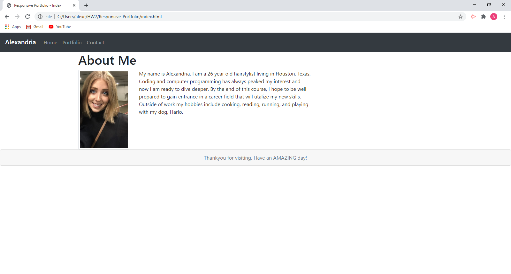
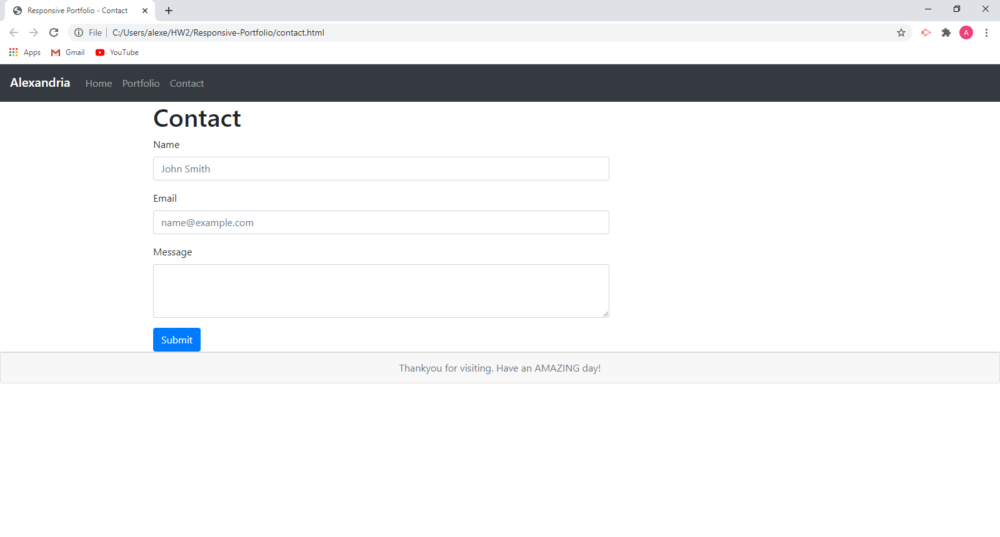
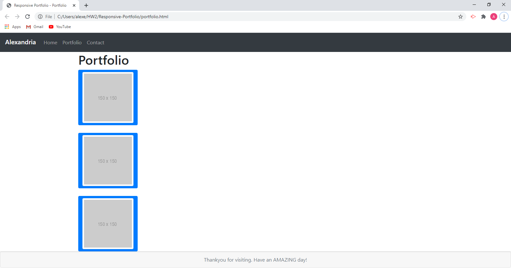

# Responsive-Portfolio
<a href="https://alexemrob.github.io/Responsive-Portfolio/">View My Page!</a>

 

<h3>Unit 02 CSS and Bootstrap Homework</h3>
  
Responsive design means that my page displays properly on most screen sizes. As a
     developer I will need these types of skills to enhance other web pages. I have created
     three web pages that allow users to get to know me, contact me, and view projects
     that I have worked on.

  
As you view my work you will notice:

  <ul>
  <li>consistent nav bar</li>
  <li>responsive layout & images</li>
  <li>functional links</li>
  <li>semantic html</li>
  <li>utilization of Bootstrap components and grid system</li>
  <li>personalized information</li>
  <li>an attempt at the bonus footer request</li>
  </ul>
